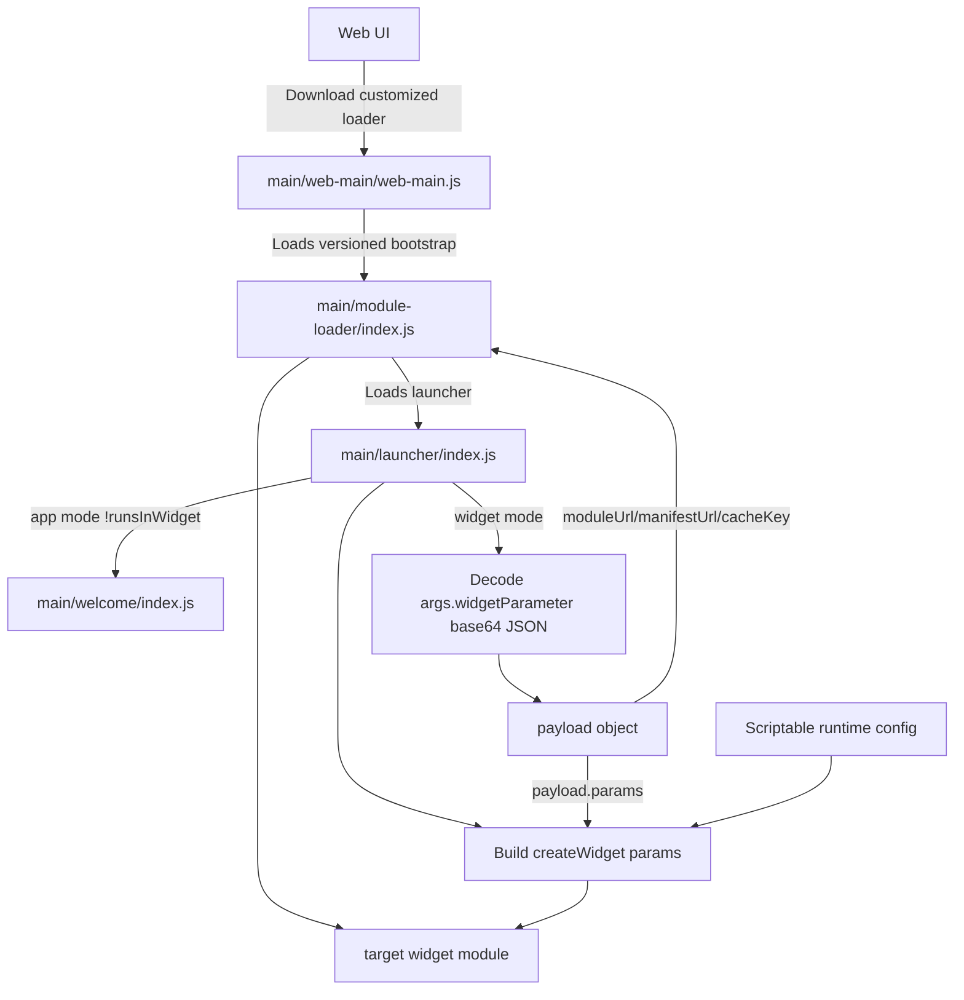

# Widget Template Contract

Use `template/index.js` and `template/manifest.json` as the starting point for new widgets.

## End-to-end flow



## Required export

- `createWidget(params)`

## Optional exports

- `launch(params)` for direct Scriptable execution
- `widgetParameter: string`
- `supportedFamilies: string[]`

## Direct Scriptable run (no launcher)

`template/index.js` includes a standalone trigger that calls `launch()` and opens a Scriptable `Alert` prompt for:

- API key (optional)
- `message` (optional demo parameter)
- required widget parameter (if `widgetParameter` export is non-empty)

To run directly in Scriptable, call `launch()` manually:

```js
const widgetModule = importModule("template/index")
await widgetModule.launch({ config, args, debug: true })
```

## Launcher-passed params

The launcher calls `createWidget(params)` with:

- `debug`
- `apiKey`
- `apiProvider`
- `loaderVersion`
- `params` (equals `payload.params` object, or `{}`)
- all fields from `payload.params` (flattened into top-level)
- Scriptable runtime config fields (for example `widgetFamily`, `runsInWidget`)
- `params` is always normalized to a plain key-value object (`{}` when missing/invalid)

Merge order in launcher:

1. base fields
2. `params` object assignment
3. flattened `payload.params`
4. runtime config

So later layers can override earlier values.

## Named parameter style in child widget

You can avoid a confusing generic `params` bag by destructuring:

```js
async function createWidget({
  message = "",
  params = {},
  debug = false,
  widgetFamily,
  ...rest
} = {}) {
  // `message` is optional demo-only field
  // `params` is a key-value object from payload.params
}
```

## Payload shape (base64 JSON in `args.widgetParameter`)

```json
{
  "moduleUrl": "https://widgets.taoradar.space/bittensor/metagraph/index.js",
  "manifestUrl": "https://widgets.taoradar.space/bittensor/metagraph/manifest.json",
  "cacheKey": "metagraph_main",
  "params": {
    "message": "Hello from payload"
  }
}
```
